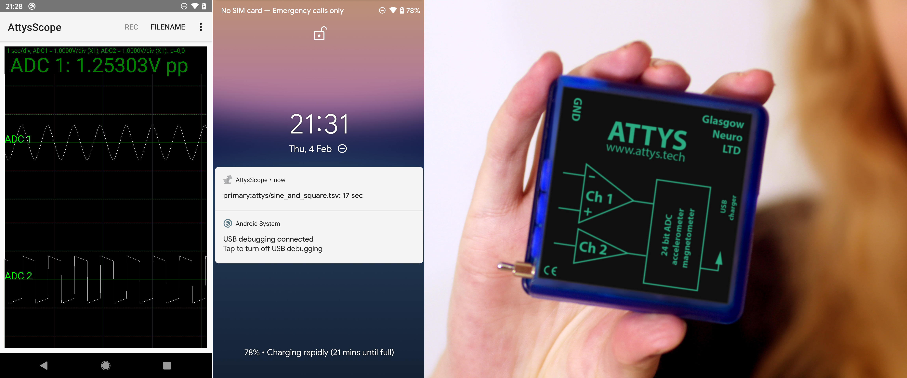

# AttysScope

Oscilloscope app for [Attys](http://www.attys.tech)

## Features

* Realtime plot of all Attys channels: ADC1,ADC2,Accelerometer & Magnetometer
* Can record in the background -- even with the lockscreen on
* Reconnects automatically in case of a temporary connection loss
* Fourier Spectrum plot
* RMS and Peak to Peak plots and/or info texts
* Heartrate over time with heartrate variability stats
* Save the data in Python / MATLAB(tm) compatible format

## Link to Google Play Store

[https://play.google.com/store/apps/details?id=tech.glasgowneuro.attysscope2]

## Dataformat

The files are tab, comma or space separated text files. The columns are:

 0. Time in sec
 1. Acceleration X in m/s^2
 2. Acceleration Y in m/s^2
 3. Acceleration Z in m/s^2
 4. Magnetic field X in T
 5. Magnetic field Y in T
 6. Magnetic field Z in T
 7. Analogue channel 1 (unfiltered) in V
 8. Analogue channel 2 (unfiltered) in V
 9. DIO 0
 10. DIO 1
 11. Charging
 12. Analogue channel 1 (filtered) in V
 13. Analogue channel 2 (filtered) in V
