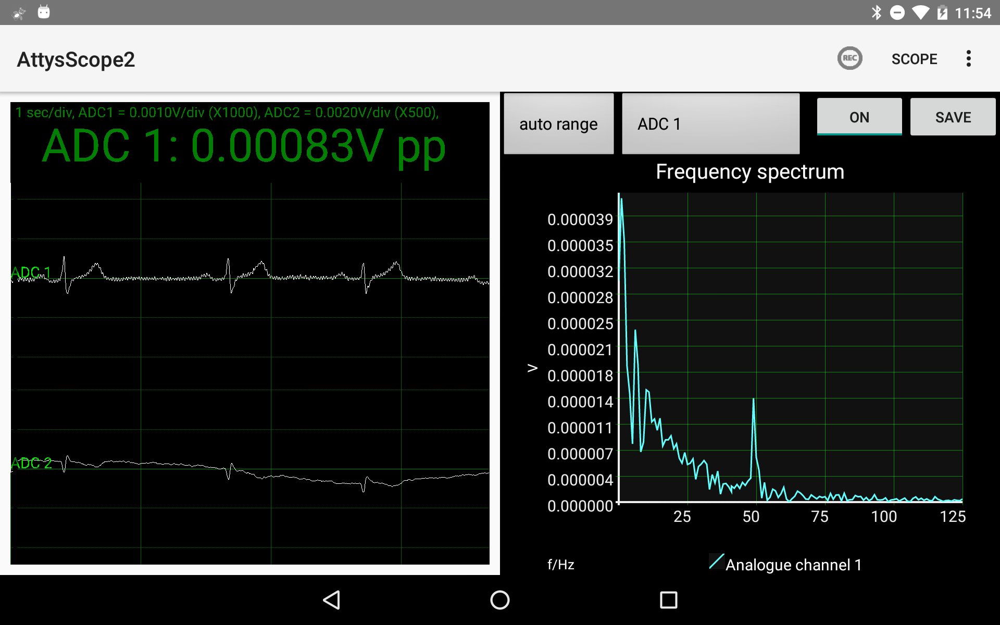

# AttysScope

Oscilloscope app for [Attys](http://www.attys.tech)

## Features

* Realtime plot of all Attys channels: ADC1,ADC2,Accelerometer & Magnetometer
* Fourier Spectrum plot
* RMS and Peak to Peak plots and/or info texts
* Heartrate over time with heartrate variability stats
* Save the data in OCTAVE/MATLAB(tm)/PYTHON compatible format

## Link to Google Play Store

[https://play.google.com/store/apps/details?id=tech.glasgowneuro.attysscope2]
