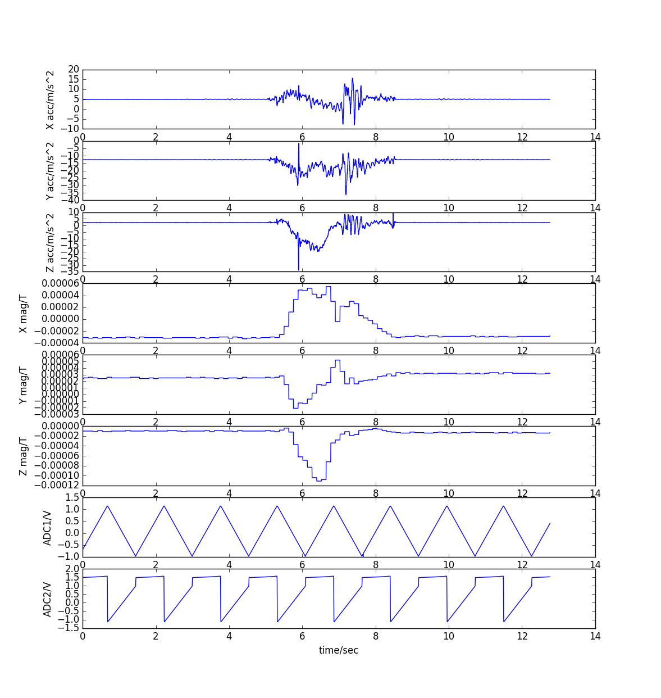

# Python scripts

This folder contains an example python script which plots all channels in a pretty form.

Here is the png file generated by the script:

You can save the plot in many popular data formats, for example SVG!
